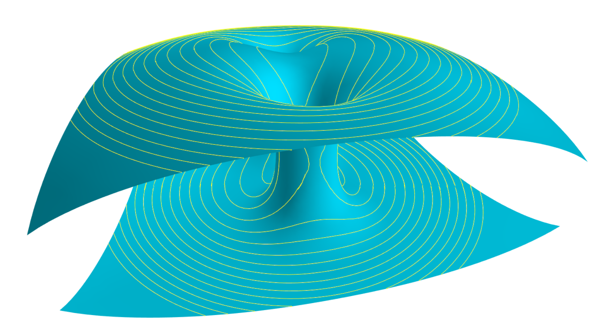

# LevelSets.jl
Compute level sets of functions on a mesh. The marching algorithms don't assume an specific form
of the underlying mesh of the space where the level sets are being computed. These meshes are provided
by the user. This allows the construction of level sets in "curved spaces".




## Level curves on a surface

see [CurvesInMesh Demo](demos/CurvesInMesh.ipynb)

By a surface we will understand  2-dimensional mesh that consists of a collections of points `ps` and a collection of triangles `ts`.
The type of `ps` is assumed to be a Julia array of dimensions `n x d`, where `n` is the number of points
in the mesh and `d` the dimension on which these points live (usually `n=2,3`). A row of `ps` represents
and individual point in the mesh. The Julia array  `ts` is assumed to have dimensions `m x 3`, where `m` is the number of
triangles in the mesh. A row in `ts` consists of three integers that point to the indices in `ps` that
form an individual triangle.

A function on a mesh is a collection of values `fs` on the vertices of the mesh, which can be obtained using
code as the following one

```julia
f(x,y,z) = 3(x^2+y^2) # Choose your function here
x = ps[:,1]
y = ps[:,2]
z = ps[:,3]
fs = f.(x,y,z)
```

We can then obtain a level curve as follows

```julia
level = 1.5 #
les =  levelcurve(ps, ts, fs,level)
```

The resulting array `les` (level edges) has shape `k x 2d`, where `k` is the number of edges
in the level set and `d` is the dimension of the underlying space (usually `k=2,3`).
Each row in `les`  represent the two end points of a line in the level set.

---

# Level surfaces in 3-dimensional space
